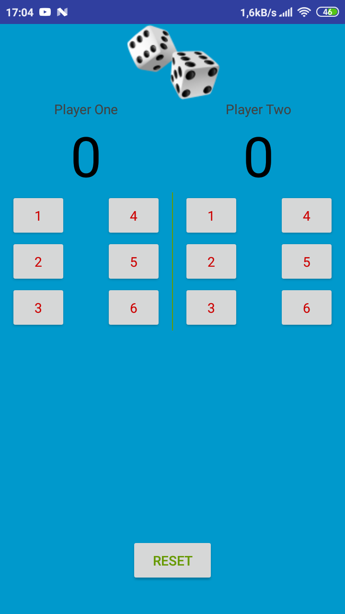

# Score Keeper
> A simple score keeping app

## Table of contents
* [General info](#general-info)
* [Screenshots](#screenshots)
* [Technologies](#technologies)
* [Setup](#setup)
* [Features](#features)
* [Status](#status)
* [Inspiration](#inspiration)
* [Contact](#contact)

## General info
One of the projects made during Adroid Basics Nanodegree by Google course.

## Screenshots

## Technologies
* Java

## Setup
Install on any Android device

## Code Examples
Show examples of usage:

public class MainActivityTest {

    @Rule
    public ActivityTestRule<MainActivity> mActivityTestRule = new ActivityTestRule<MainActivity>(MainActivity.class);

    private MainActivity mActivity = null;

    @Before
    public void setUp() throws Exception {

        mActivity = mActivityTestRule.getActivity();
    }

    @Test
    public void testLaunch(){

        View view = mActivity.findViewById(R.id.player_one_score);

        assertNotNull(view);

    }

    @After
    public void tearDown() throws Exception {

        mActivity = null;
    }
}

## Features
List of features ready and TODOs for future development
* Track score of dice game for two players

To-do list:
* Save score

## Status
Project is: finished

## Inspiration
Thanks to all mentors from Udacity

## Contact
Created by [@adorek](http://www.adamrafinski.pl/) - feel free to contact me!
